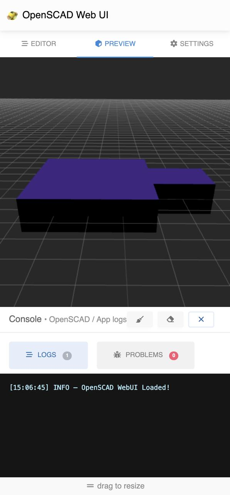

#  OpenSCAD WebUI

This project provides a web-based user interface for OpenSCAD, allowing users to create, edit, and render 3D models
directly in their web browsers. It leverages WebAssembly to run OpenSCAD in the browser, providing a seamless experience
without the need for local installations.

  
  

> [!IMPORTANT]  
> This project is in its early stages and may not yet support all OpenSCAD features or some features may not work as
expected. Contributions and feedback are welcome!

## Features

- **Web-Based Interface**: Access OpenSCAD from any device with a web browser.
- **User-Friendly UI**: Intuitive interface designed for both beginners and experienced users.
- **Mobile First**: Optimized for mobile devices, ensuring a smooth experience on smartphones and tablets.

## Author

Daniel Vinciguerra
